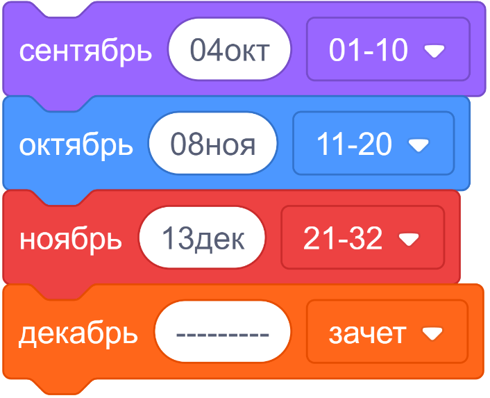

== Алгоритмы и структуры данных в системах реального времени

image:https://github.com/BasePractice/algorithms-and-data-structures-2024/actions/workflows/codeql-analysis.yml/badge.svg[link="https://github.com/BasePractice/algorithms-and-data-structures-2024/actions/workflows/codeql-analysis.yml"]
image:https://github.com/BasePractice/algorithms-and-data-structures-2024/actions/workflows/maven.yml/badge.svg[link="https://github.com/BasePractice/algorithms-and-data-structures-2024/actions/workflows/maven.yml"]

=== Задания студентов

1. link:students/0000001/README.adoc[0000001]

В качестве имени студента указывается его номер зачетной книжки, также, в README модуля указывается фамилия студента.

Например вместо `0000001` пишется `21K0478` при этом все символы кириллицы заменяются на соответствующие им транслитерированные латинские.

Видео руководство по работе с репозиторием, отправка на сдачу работы, приемка ее преподавателем и дальнейшее обновление репозитория студентом https://disk.yandex.ru/d/A2_hFJlU1Oy3pg[]

=== Сроки сдачи

Указаны даты последнего приема заданий. Если в этот день пришел `PR` и не был принят, задание считается не сданным.

[source,scratch-v3.0]
----
сентябрь [04окт] [01-10 v] :: looks
октябрь  [08ноя] [11-20 v] :: motion
ноябрь   [13дек] [21-32 v]
декабрь  [---------] [зачет v] :: list
----
